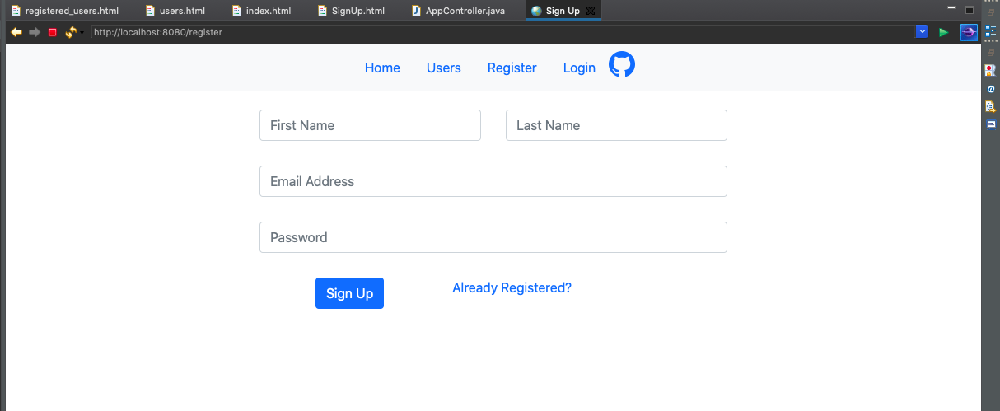
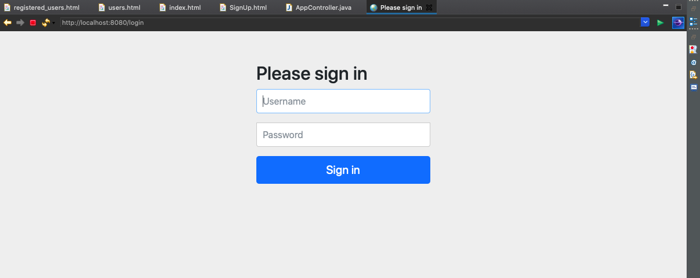
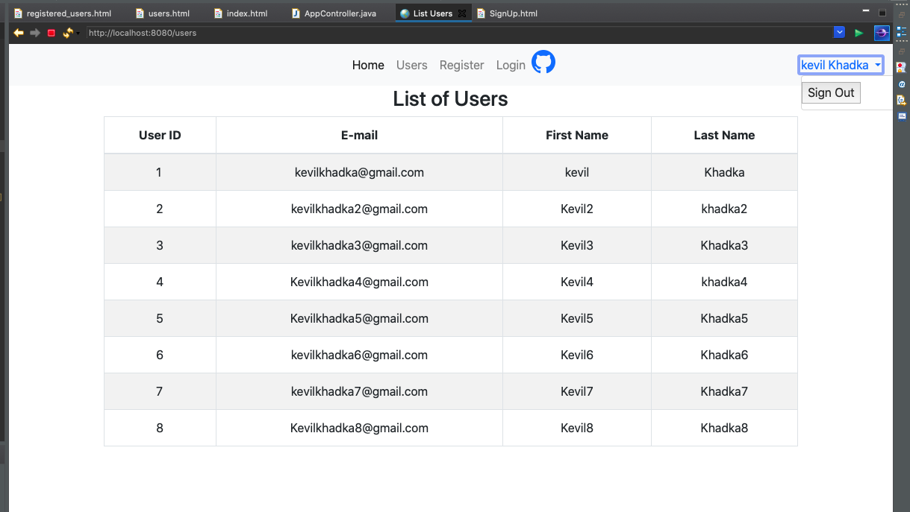
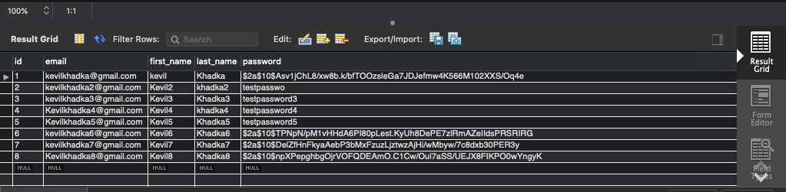

# User Registation Application

This Java Web Application program is written in Spring IDE (STS 4). This program is able to register the user information using their first name, last name, email ID, and user ID information. After signing up, users can return to page by using their credential informations such as User Email and Password. By the way, user's passwords are encrypted and restored in MySQL database.

<p align="center">
	
</p>

Lets start with a new Spring Starter Project using Maven Type and Java Language. We used java version 11 in this program. The Spring boot version is 2.4.2. For this project, we used following dependencies: 

1. MySQL Driver - To store user database.

2. Spring Boot DevTools - It help to improve the development time while working with the Spring Boot application. It pick up the changes and the restart the application.

3. Spring Data JPA - It helps to access and persist data between java object/class and relational database.

4. Spring boot Web - It is better use if we want to develop a simple Spring-based application or RESTful services. 

5. Spring Security - Its operation to handle authentication and authorization at the Web request level as well as the method invocation level.

6. Thymeleaf - Java based library to create a web application.


Since we chose the following dependencies, the [pom.xml](https://github.com/kk289/UserRegistrationApp/blob/main/pom.xml) file is as follow: 

<details>
	<SUMMARY><b>pom.xml</b></SUMMARY>

```
<?xml version="1.0" encoding="UTF-8"?>
<project xmlns="http://maven.apache.org/POM/4.0.0" xmlns:xsi="http://www.w3.org/2001/XMLSchema-instance"
	xsi:schemaLocation="http://maven.apache.org/POM/4.0.0 https://maven.apache.org/xsd/maven-4.0.0.xsd">
	<modelVersion>4.0.0</modelVersion>
	<parent>
		<groupId>org.springframework.boot</groupId>
		<artifactId>spring-boot-starter-parent</artifactId>
		<version>2.4.2</version>
		<relativePath/> <!-- lookup parent from repository -->
	</parent>
	<groupId>com.example</groupId>
	<artifactId>UserApp</artifactId>
	<name>UserApp</name>
	<description>User Registration </description>

	<properties>
		<java.version>11</java.version>
	</properties>

	<dependencies>
		<dependency>
			<groupId>org.springframework.boot</groupId>
			<artifactId>spring-boot-starter-data-jpa</artifactId>
		</dependency>
		<dependency>
			<groupId>org.springframework.boot</groupId>
			<artifactId>spring-boot-starter-security</artifactId>
		</dependency>
		<dependency>
			<groupId>org.springframework.boot</groupId>
			<artifactId>spring-boot-starter-thymeleaf</artifactId>
		</dependency>
		<dependency>
			<groupId>org.springframework.boot</groupId>
			<artifactId>spring-boot-starter-web</artifactId>
		</dependency>
		<dependency>
			<groupId>org.thymeleaf.extras</groupId>
			<artifactId>thymeleaf-extras-springsecurity5</artifactId>
		</dependency>

		<dependency>
			<groupId>org.springframework.boot</groupId>
			<artifactId>spring-boot-devtools</artifactId>
			<scope>runtime</scope>
			<optional>true</optional>
		</dependency>
		<dependency>
			<groupId>mysql</groupId>
			<artifactId>mysql-connector-java</artifactId>
			<scope>runtime</scope>
		</dependency>
		<dependency>
			<groupId>org.springframework.boot</groupId>
			<artifactId>spring-boot-starter-test</artifactId>
			<scope>test</scope>
		</dependency>
		<dependency>
			<groupId>org.springframework.security</groupId>
			<artifactId>spring-security-test</artifactId>
			<scope>test</scope>
		</dependency>
	</dependencies>

	<build>
		<plugins>
			<plugin>
				<groupId>org.springframework.boot</groupId>
				<artifactId>spring-boot-maven-plugin</artifactId>
			</plugin>
		</plugins>
	</build>

</project>
```

</details>

<details>
	<SUMMARY><b>Create Database</b></SUMMARY>

Setup the MySQL server and create a database to store the users information.

<p align="center">
	
</p>

<p align="center">
	
</p>

</details>

Now we need to setup the Spring Boot configuration file "application.properties" under src/main/resources directory. We enter following properties for configuring a data source that will be used by Spring Data JPA. We start with mysql database link including username and password for that source. here, spring.jpa.hibernate.ddl-auto help to create the tables in the database with the help of hibernate.format_sql when we run a unit test later. 

NOTE: Once we run the unit test later, we need to change spring.jpa.hibernate.ddl-auto property to none since we dont need more table in the database.

#### src/main/resources/application.properties
```
spring.datasource.url=jdbc:mysql://localhost:3306/userappdb
spring.datasource.username=root
spring.datasource.password=password

spring.jpa.hibernate.ddl-auto=create
spring.jpa.properties.hibernate.format_sql=true
```


#### src/main/java/com.example.userapp/User.java

we need the user information consists of firstname, lastname, user ID, email and password. Lets create a new java class named User to map with the corresponding users table in the database.

```
package com.example.userapp;

import javax.persistence.Column;
import javax.persistence.Entity;
import javax.persistence.GeneratedValue;
import javax.persistence.GenerationType;
import javax.persistence.Id;
import javax.persistence.Table;

@Entity
@Table(name = "users")
public class User {
	
	@Id
	@GeneratedValue(strategy = GenerationType.IDENTITY)
	private Long id;
	
	@Column(nullable = false, unique = true, length = 64)
	private String email;
	
	@Column(nullable = false, length = 64)
	private String password;
	
	@Column(name = "first_name", nullable = false, length = 64)
	private String firstName;
	
	@Column(name = "last_name", nullable = false, length = 64)
	private String lastName;

	
	public Long getId() { return id; }
	public void setId(Long id) { this.id = id; }
	
	public String getEmail() { return email; }
	public void setEmail(String email) { this.email = email; }

	public String getPassword() { return password; }
	public void setPassword(String password) { this.password = password; }

	public String getFirstName() { return firstName; }
	public void setFirstName(String firstName) { this.firstName = firstName; }

	public String getLastName() { return lastName; }
	public void setLastName(String lastName) { this.lastName = lastName; }
}
```

#### src/main/java/com.example.userapp/UserRepository.java

We need to create a new interface named UserRepository to act as a Spring Data JPA repository. This interface is a subtype of JpaRepository which defines common persistance operations and the implementations will be generated at runtime by Spring Data JPA.

```
package com.example.userapp;

import org.springframework.data.jpa.repository.JpaRepository;
import org.springframework.data.jpa.repository.Query;

public interface UserRepository extends JpaRepository<User, Long> {

	@Query("SELECT u FROM User u WHERE u.email = ?1")
	public User findByEmail(String email);
}
```

### Run JUnit Test

#### src/test/java/com.example.userapp/UserRepositoryTests.java

Now it is time to do some basic code testing. We create a new java class under src/test/java directory for testing Spring Data JPA repositories.It is configured to work with the actual database ("userappdb") and commit the changes.

```
package com.example.userapp;

import static org.assertj.core.api.Assertions.assertThat;

import org.junit.jupiter.api.Test;
import org.springframework.beans.factory.annotation.Autowired;
import org.springframework.boot.test.autoconfigure.jdbc.AutoConfigureTestDatabase;
import org.springframework.boot.test.autoconfigure.jdbc.AutoConfigureTestDatabase.Replace;
import org.springframework.boot.test.autoconfigure.orm.jpa.DataJpaTest;
import org.springframework.boot.test.autoconfigure.orm.jpa.TestEntityManager;
import org.springframework.test.annotation.Rollback;

@DataJpaTest
@AutoConfigureTestDatabase(replace = Replace.NONE)
@Rollback(false)
public class UserRepositoryTests {

	@Autowired
	private TestEntityManager entityManager;
	
	@Autowired
	private UserRepository repo;
	
	@Test
	public void testCreateUser() {
		User user = new User();
		user.setEmail("kevilkhadka@gmail.com");
		user.setPassword("testpassword");
		user.setFirstName("kevil");
		user.setLastName("Khadka");
		
		User savedUser = repo.save(user);
		
		User existUser = entityManager.find(User.class, savedUser.getId());
		
		assertThat(user.getEmail()).isEqualTo(existUser.getEmail());		
	}
}
```

We run testCreateUser() as JUnit test and get following result. Here the JUnit test run successfully and create a SQL statement in the console output. 

<p align="center">
	
</p>

And we can see the user data information stored in SQL database permanently.

<p align="center">
	
</p>


### Run Next JUnit Test

Let test the program by adding another user information. But we need to do some changes in application.properties file. Since we already created a table, we don't need to create another so we replace "create" with "none".
```
spring.jpa.hibernate.ddl-auto=none
```

<p align="center">
	
</p>


Next, let’s create a Spring MVC controller class named AppController, with the first handler method to show the home page. And under /src/main/resources/templates directory, create a new HTML file named index.html.

#### src/main/java/com.example.userapp/AppController.java

```
package com.example.userapp;

import org.springframework.stereotype.Controller;
import org.springframework.web.bind.annotation.GetMapping;

@Controller
public class AppController {
	
	@GetMapping("")
	public String viewHomePage() {
		return "index";
	}
}
```

Now lets run the Spring boot project program, by default, we get following result:

<p align="center">
	
</p>


We can use the Bootstrap and JQuery from Webjars to modify the web by adding their dependencies in [pom.xml](https://github.com/kk289/UserRegistrationApp/blob/main/pom.xml) file. Here, Thymeleaf help to generate the URLs properly. We can access the web application at this URL: http://localhost:8080

<details>
	<SUMMARY><b>src/main/java/com.example.userapp/CustomUserDetails.java</b></SUMMARY>

```
package com.example.userapp;

import java.util.Collection;

import org.springframework.security.core.GrantedAuthority;
import org.springframework.security.core.userdetails.UserDetails;


public class CustomUserDetails implements UserDetails {
	

private User user;
	
	public CustomUserDetails(User user) {
		this.user = user;
	}

	@Override
	public Collection<? extends GrantedAuthority> getAuthorities() {
		return null;
	}

	@Override
	public String getPassword() {
		return user.getPassword();
	}

	@Override
	public String getUsername() {
		return user.getEmail();
	}

	@Override
	public boolean isAccountNonExpired() {
		return true;
	}

	@Override
	public boolean isAccountNonLocked() {
		return true;
	}

	@Override
	public boolean isCredentialsNonExpired() {
		return true;
	}

	@Override
	public boolean isEnabled() {
		return true;
	}
	
	public String getFullName() {
		return user.getFirstName() + " " + user.getLastName();
	}
}
```
</details>

<details>
	<SUMMARY><b>src/main/java/com.example.userapp/CustomUserDetailsService.java</b></SUMMARY>

```
package com.example.userapp;

import org.springframework.beans.factory.annotation.Autowired;
import org.springframework.security.core.userdetails.UserDetails;
import org.springframework.security.core.userdetails.UserDetailsService;
import org.springframework.security.core.userdetails.UsernameNotFoundException;

public class CustomUserDetailsService implements UserDetailsService {

	@Autowired
	private UserRepository userRepo;
	
	@Override
	public UserDetails loadUserByUsername(String username) throws UsernameNotFoundException {
		User user = userRepo.findByEmail(username);
		if (user == null) {
			throw new UsernameNotFoundException("User not found");
		}
		return new CustomUserDetails(user);
	}
}
```
</details>

We need to implement the login feature. CustomUserDetails java class of subtype UserDetails (defined by Spring Security) helps to represent an authentication user while login. 

Spring Security will invoke methods in this class during the authentication process. And next Spring Security look up the user information, we implements the UserDetailsService interface. 
As you can see, Spring Security will invoke the loadUserByUsername() method to authenticate the user, and if successful, a new object of type CustomUserDetails object is created to represent the authenticated user. 

Also remember to update the UserRepository interface for adding this method:

```
public interface UserRepository extends JpaRepository<User, Long> {

	@Query("SELECT u FROM User u WHERE u.email = ?1")
	public User findByEmail(String email);
}
```

Suppose that the email column is unique in the users table, so we define the findByEmail() method that returns a single User object based on email (no two users having the same email).

#### src/test/java/com.example.userapp/UserRepositoryTests.java

```
@Test
	public void testFindByEmail() {
		String email = "kevilkhadka@gmail.com";
		User user = repo.findByEmail(email);
		
		assertThat(user.getEmail()).isEqualTo(email);
	}	
```

Lets run the Junit test and we see the JUnit test run successfully.

<p align="center">
	
</p>


<details>
	<SUMMARY><b>src/main/java/com.example.userapp/WebSecurityConfig.java</b></SUMMARY>

```
package com.example.userapp;

import javax.sql.DataSource;

import org.springframework.beans.factory.annotation.Autowired;
import org.springframework.context.annotation.Bean;
import org.springframework.context.annotation.Configuration;
import org.springframework.security.authentication.dao.DaoAuthenticationProvider;
import org.springframework.security.config.annotation.authentication.builders.AuthenticationManagerBuilder;
import org.springframework.security.config.annotation.web.builders.HttpSecurity;
import org.springframework.security.config.annotation.web.configuration.EnableWebSecurity;
import org.springframework.security.config.annotation.web.configuration.WebSecurityConfigurerAdapter;
import org.springframework.security.core.userdetails.UserDetailsService;
import org.springframework.security.crypto.bcrypt.BCryptPasswordEncoder;

@Configuration
@EnableWebSecurity
public class WebSecurityConfig extends WebSecurityConfigurerAdapter {

	@Autowired
	private DataSource dataSource;
	
	@Bean
	public UserDetailsService userDetailsService() {
		return new CustomUserDetailsService();
	}
	
	@Bean
	public BCryptPasswordEncoder passwordEncoder() {
		return new BCryptPasswordEncoder();
	}
	
	@Bean
	public DaoAuthenticationProvider authenticationProvider() {
		DaoAuthenticationProvider authProvider = new DaoAuthenticationProvider();
		authProvider.setUserDetailsService(userDetailsService());
		authProvider.setPasswordEncoder(passwordEncoder());
		
		return authProvider;
	}
	
	@Override
	protected void configure(AuthenticationManagerBuilder auth) throws Exception {
		auth.authenticationProvider(authenticationProvider());
	}
	
	@Override
	protected void configure(HttpSecurity http) throws Exception {
		http.authorizeRequests()
			.antMatchers("/users").authenticated()
			.anyRequest().permitAll()
			.and()
			.formLogin()
				.usernameParameter("email")
				.defaultSuccessUrl("/users")
				.permitAll()
			.and()
			.logout().logoutSuccessUrl("/").permitAll();
	}
}
```
</details>

In the WebSecurityConfig.java class, the configure() method where a user must login to see the list users page (URL /users) and other pages do not require authentication. We also configure the default login page (generated by Spring Security) with the parameter name of the username field is email and the default success URL is /users – that means after successful login, the user will be redirected to the list users page.

Now once we run the test of login function. We can see click login link as the default login page.

Also we create a user.html file under src/main/resources/templates directory. This page consists of two parts: the first part shows the user’s full name with Logout button; and the second one lists all users in the database.

Meanwhile we need to update AppController file with following listUsers() method:

```
@GetMapping("/users")
	public String listUsers(Model model) {
		List<User> listUsers = userRepo.findAll();
		model.addAttribute("listUsers", listUsers);
		
		return "users";
	}
```

Since all stored users password are visible on sql database, we need to encrypt them. Lets create a java class PasswordEncoder under src/main/java directory.

<details>
	<SUMMARY><b>src/test/java/com.example.userapp/PasswordEncoder.java</b></SUMMARY>

```
package com.example.userapp;

import org.springframework.security.crypto.bcrypt.BCryptPasswordEncoder;

public class PasswordEncoder {

	public static void main(String[] args) {

		BCryptPasswordEncoder passwordEncoder = new BCryptPasswordEncoder();
		String rawPassword = "testpassword";
		String encodedPassword = passwordEncoder.encode(rawPassword);

		System.out.println(encodedPassword);
	}
}
```
</details>


Lets run the PasswordEncoder.java file as the Java Application and we get following result in the console. 

```
$2a$10$Asv1jChL8/xw8b.k/bfTOOzsleGa7JDJefmw4K566M102XXS/Oq4e
```

Now copy the code from the console and paste it to the sql database table under password correspond to email user we used.It looks like following screenshot. After that click on apply, and apply. Once its done, all new users' passwords are encrypted and stored in the sql database.

<p align="center">
	
</p>


Lets run the spring boot program, and open the url, http://localhost:8080, in any browser and we should get following results:

#### Homepage
<p align="center">
	
</p>

#### Register Page
<p align="center">
	
</p>

#### Login Page
<p align="center">
	
</p>

#### List of Users Stored
<p align="center">
	
</p>

#### SQL Database
<p align="center">
	
</p>


### User Update Feature

Here, we added new edit and delete features where we can edit user information and delete registred user. 

#### src/main/java/com/example/userapp/AppController.java
```
// Delete 
	@GetMapping("/users/{id}")
	public String deleteUser(@PathVariable("id") long id, Model model) {
	    User user = userRepo.findById(id).orElseThrow(() -> new IllegalArgumentException("Invalid user Id:" + id));
	    userRepo.delete(user);
	    return "redirect:/users";
	}
```

```
// Update user
	@SuppressWarnings("unlikely-arg-type")
	@GetMapping("/edit/{id}")
	public String updateUser(@PathVariable("id") Long userId, Model model) throws ResourceNotFoundException {
	    User user = userRepo.findById(userId).orElseThrow(() -> new IllegalArgumentException("Invalid user id :" + userId));
	    model.addAttribute(user);
	    userRepo.equals(user);
	    return "update_user";
	    
	  }
	
	@PostMapping("/edit/{id}")
	public String update_User(User user, BindingResult bindingResult) throws ResourceNotFoundException {
		BCryptPasswordEncoder passwordEncoder = new BCryptPasswordEncoder();
		String encodedPassword = passwordEncoder.encode(user.getPassword());
		user.setPassword(encodedPassword);
		userRepo.save(user);
		
		BCryptPasswordEncoder confirmpasswordEncoder = new BCryptPasswordEncoder();
		String encodedconfirmPassword = confirmpasswordEncoder.encode(user.getConfirmPassword());
		user.setConfirmPassword(encodedconfirmPassword);
		userRepo.save(user);
		
		return "redirect:/users";
	}
```
<p align="center">
	
</p>

### How to create .jar file

#### UserApp/target/UserApp-2.4.2.jar

<p align="center">
	
</p>
