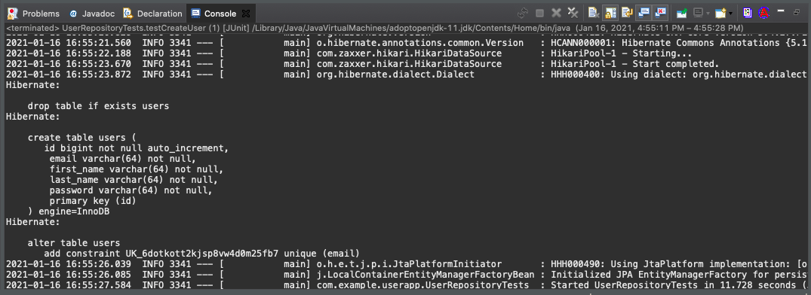

# User Registation Application

This Java Web Application program is written in Spring IDE (STS 4). This program is able to register the user information using their first name, last name, email ID, and user ID information. After signing up, users can return to page by using their credential informations such as User ID and Password. By the way, all users' password are encrypted and restored in MySQL database.

Lets start with a new Spring Starter Project using Maven Type and Java Language. We used java version 11 in this program. The Spring boot version is 2.4.2. For this project, we used following dependencies: 

1. MySQL Driver - To store user database.

2. Spring Boot DevTools - It help to improve the development time while working with the Spring Boot application. It pick up the changes and the restart the application.

3. Spring Data JPA - It helps to access and persist data between java object/class and relational database.

4. Spring boot Web - It is better use if we want to develop a simple Spring-based application or RESTful services. 

5. Spring Security - Its operation to handle authentication and authorization at the Web request level as well as the method invocation level.

6. Thymeleaf - Java based library to create a web application.


Since we chose the following dependencies, the [pom.xml](https://github.com/kk289/UserRegistrationApp/blob/main/pom.xml) file is as follow: 

<details>
	<SUMMARY><b>pom.xml</b></SUMMARY>

```
<?xml version="1.0" encoding="UTF-8"?>
<project xmlns="http://maven.apache.org/POM/4.0.0" xmlns:xsi="http://www.w3.org/2001/XMLSchema-instance"
	xsi:schemaLocation="http://maven.apache.org/POM/4.0.0 https://maven.apache.org/xsd/maven-4.0.0.xsd">
	<modelVersion>4.0.0</modelVersion>
	<parent>
		<groupId>org.springframework.boot</groupId>
		<artifactId>spring-boot-starter-parent</artifactId>
		<version>2.4.2</version>
		<relativePath/> <!-- lookup parent from repository -->
	</parent>
	<groupId>com.example</groupId>
	<artifactId>UserApp</artifactId>
	<version>0.0.1-SNAPSHOT</version>
	<name>UserApp</name>
	<description>User Registration </description>

	<properties>
		<java.version>11</java.version>
	</properties>

	<dependencies>
		<dependency>
			<groupId>org.springframework.boot</groupId>
			<artifactId>spring-boot-starter-data-jpa</artifactId>
		</dependency>
		<dependency>
			<groupId>org.springframework.boot</groupId>
			<artifactId>spring-boot-starter-security</artifactId>
		</dependency>
		<dependency>
			<groupId>org.springframework.boot</groupId>
			<artifactId>spring-boot-starter-thymeleaf</artifactId>
		</dependency>
		<dependency>
			<groupId>org.springframework.boot</groupId>
			<artifactId>spring-boot-starter-web</artifactId>
		</dependency>
		<dependency>
			<groupId>org.thymeleaf.extras</groupId>
			<artifactId>thymeleaf-extras-springsecurity5</artifactId>
		</dependency>

		<dependency>
			<groupId>org.springframework.boot</groupId>
			<artifactId>spring-boot-devtools</artifactId>
			<scope>runtime</scope>
			<optional>true</optional>
		</dependency>
		<dependency>
			<groupId>mysql</groupId>
			<artifactId>mysql-connector-java</artifactId>
			<scope>runtime</scope>
		</dependency>
		<dependency>
			<groupId>org.springframework.boot</groupId>
			<artifactId>spring-boot-starter-test</artifactId>
			<scope>test</scope>
		</dependency>
		<dependency>
			<groupId>org.springframework.security</groupId>
			<artifactId>spring-security-test</artifactId>
			<scope>test</scope>
		</dependency>
	</dependencies>

	<build>
		<plugins>
			<plugin>
				<groupId>org.springframework.boot</groupId>
				<artifactId>spring-boot-maven-plugin</artifactId>
			</plugin>
		</plugins>
	</build>

</project>
```

</details>

<details>
	<SUMMARY><b>Create Database</b></SUMMARY>

Setup the MySQL server and create a database to store the users information.

<p align="center">
	
</p>

<p align="center">
	
</p>

</details>

Now we need to setup the Spring Boot configuration file "application.properties" under src/main/resources directory. We enter following properties for configuring a data source that will be used by Spring Data JPA. We start with mysql database link including username and password for that source. here, spring.jpa.hibernate.ddl-auto help to create the tables in the database with the help of hibernate.format_sql when we run a unit test later. 

NOTE: Once we run the unit test later, we need to change spring.jpa.hibernate.ddl-auto property to none since we dont need more table in the database.

#### src/main/resources/application.properties
```
spring.datasource.url=jdbc:mysql://localhost:3306/userappdb
spring.datasource.username=root
spring.datasource.password=password

spring.jpa.hibernate.ddl-auto=create
spring.jpa.properties.hibernate.format_sql=true
```


#### src/main/java/com.example.userapp/User.java

we need the user information consists of firstname, lastname, user ID, email and password. Lets create a new java class named User to map with the corresponding users table in the database.

```
package com.example.userapp;

import javax.persistence.Column;
import javax.persistence.Entity;
import javax.persistence.GeneratedValue;
import javax.persistence.GenerationType;
import javax.persistence.Id;
import javax.persistence.Table;

@Entity
@Table(name = "users")
public class User {
	
	@Id
	@GeneratedValue(strategy = GenerationType.IDENTITY)
	private Long id;
	
	@Column(nullable = false, unique = true, length = 64)
	private String email;
	
	@Column(nullable = false, length = 64)
	private String password;
	
	@Column(name = "first_name", nullable = false, length = 64)
	private String firstName;
	
	@Column(name = "last_name", nullable = false, length = 64)
	private String lastName;

	
	public Long getId() { return id; }
	public void setId(Long id) { this.id = id; }
	
	public String getEmail() { return email; }
	public void setEmail(String email) { this.email = email; }

	public String getPassword() { return password; }
	public void setPassword(String password) { this.password = password; }

	public String getFirstName() { return firstName; }
	public void setFirstName(String firstName) { this.firstName = firstName; }

	public String getLastName() { return lastName; }
	public void setLastName(String lastName) { this.lastName = lastName; }
}
```

#### src/main/java/com.example.userapp/UserRepository.java

We need to create a new interface named UserRepository to act as a Spring Data JPA repository. This interface is a subtype of JpaRepository which defines common persistance operations and the implementations will be generated at runtime by Spring Data JPA.

```
package com.example.userapp;

import org.springframework.data.jpa.repository.JpaRepository;
import org.springframework.data.jpa.repository.Query;

public interface UserRepository extends JpaRepository<User, Long> {

	@Query("SELECT u FROM User u WHERE u.email = ?1")
	public User findByEmail(String email);
}
```

### Run JUnit Test

#### src/test/java/com.example.userapp/UserRepositoryTests.java

Now it is time to do some basic code testing. We create a new java class under src/test/java directory for testing Spring Data JPA repositories.It is configured to work with the actual database ("userappdb") and commit the changes.

```
package com.example.userapp;

import static org.assertj.core.api.Assertions.assertThat;

import org.junit.jupiter.api.Test;
import org.springframework.beans.factory.annotation.Autowired;
import org.springframework.boot.test.autoconfigure.jdbc.AutoConfigureTestDatabase;
import org.springframework.boot.test.autoconfigure.jdbc.AutoConfigureTestDatabase.Replace;
import org.springframework.boot.test.autoconfigure.orm.jpa.DataJpaTest;
import org.springframework.boot.test.autoconfigure.orm.jpa.TestEntityManager;
import org.springframework.test.annotation.Rollback;

@DataJpaTest
@AutoConfigureTestDatabase(replace = Replace.NONE)
@Rollback(false)
public class UserRepositoryTests {

	@Autowired
	private TestEntityManager entityManager;
	
	@Autowired
	private UserRepository repo;
	
	@Test
	public void testCreateUser() {
		User user = new User();
		user.setEmail("kevilkhadka@gmail.com");
		user.setPassword("testpassword");
		user.setFirstName("kevil");
		user.setLastName("Khadka");
		
		User savedUser = repo.save(user);
		
		User existUser = entityManager.find(User.class, savedUser.getId());
		
		assertThat(user.getEmail()).isEqualTo(existUser.getEmail());		
	}
}
```

We run testCreateUser() as JUnit test and get following result. Here the JUnit test run successfully and create a SQL statement in the console output. 

<p align="center">
	
</p>

And we can see the user data information stored in SQL database permanently.

<p align="center">
	
</p>


### Run Next JUnit Test

Let test the program by adding another user information. But we need to do some changes in application.properties file. Since we already created a table, we don't need to create another so we replace "create" with "none".
```
spring.jpa.hibernate.ddl-auto=none
```

<p align="center">
	
</p>


Next, let’s create a Spring MVC controller class named AppController, with the first handler method to show the home page. And under /src/main/resources/templates directory, create a new HTML file named index.html.

#### src/main/java/com.example.userapp/AppController.java

```
package com.example.userapp;

import org.springframework.stereotype.Controller;
import org.springframework.web.bind.annotation.GetMapping;

@Controller
public class AppController {
	
	@GetMapping("")
	public String viewHomePage() {
		return "index";
	}
}
```

Now lets run the Spring boot project program, by default, we get following result:

<p align="center">
	
</p>


We can use the Bootstrap and JQuery from Webjars to modify the web by adding their dependencies in [pom.xml](https://github.com/kk289/UserRegistrationApp/blob/main/pom.xml) file. Here, Thymeleaf help to generate the URLs properly. We can access the web application at this URL: http://localhost:8080


